# Menú de Aplicaciones en Streamlit

Una manera interacrtiva de realizar calculos u otras operaciones con las distintas aplicaciones que ofrece la página.

[👑 Abrir en Streamlit](https://menu-aplicaciones-yeray-anguiano.streamlit.app/)

### Cómo correrlo desde tu maquina

1. Instala los requisitos

   ```
   $ pip install -r requirements.txt
   ```

2. Corre la app con streamlit

   ```
   $ streamlit run streamlit_app.py
   ```

# Para una explicación técnica detallada del codigo visite:
[🐈‍⬛Abrir en GitHub](https://github.com/YerayAnguiano/Funcionameinto-de-Menu-de-Opciones)

# Funcionamiento de Aplicaciones

Al ingresar a la página lo primero que se nos muestra es la pagina pricipal, y la sidebar de streamlit con el menú de aplicaciones.
Selecciona una aplicación haciendo click sobre del nombre de la app.


## Saluda a un colega
En esta opción simplemente se debe agregar el nombre tuyo o de un colega en el apartado y seleccionar el botón saludar. que mostrará un saludo a tu colega.


## Suma de Dos Números
Esta opción suma dos numeros que debe ingresar solo escribiendolos en sus respectivos recuadros.

Al hacer click en el botón `Sumar`, se mostrará un mensaje con el resultado de la suma.

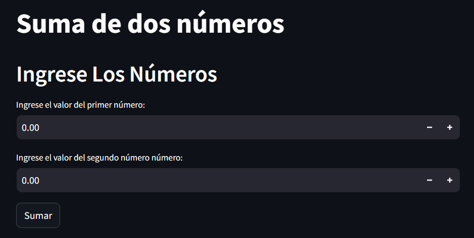

## Calcular Área de un Triangulo
Esta aplicación consta de ingresar el valor de la base y altura de un triangulo. posteriormente al seleccionar el botón `Calcular Área` muestra un mensaje con el resultado de la operación.

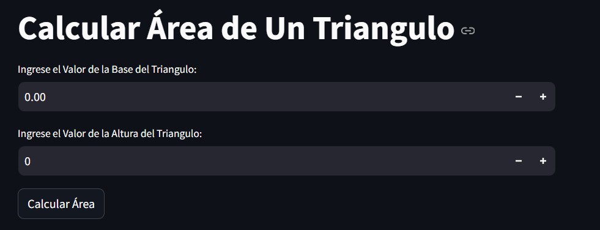

## Calculadora de Descuentos
Ingrese el valor inicial en el apartado *Ingrese la Cantidad sin Descuento* y el valor del descuento en porcentaje en el apartado *Ingrese el Valor del Porcentaje del Descuento*.

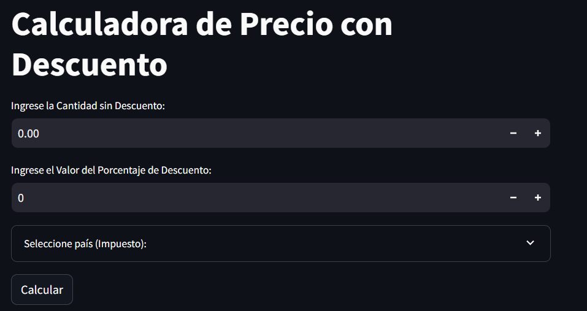

Despues al seleccionar la opcion *Seleccione país (impuesto)*, se despliega una lista con paises y al seleccionar uno se establece el impuesto del país. En caso de que no se encuentre su país, seleccione la opcion `Otro` e ingrese el valor del porcentaje de impuesto en su país.

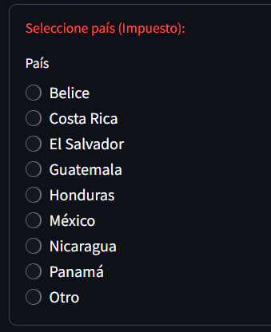

## Suma de un Conjunto de Numeros
Esta aplicación solicita ingresar una lista de numeros separados por coma. Por ejemplo: *1,2,3,5,7*. 

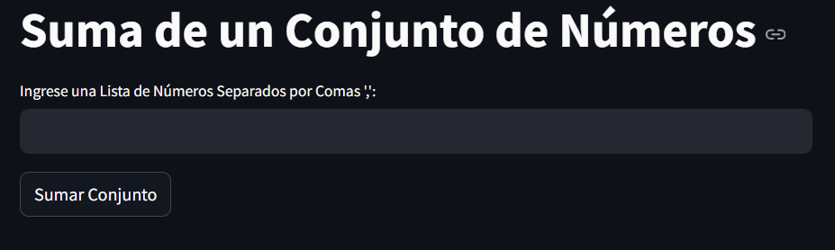

Despues de Ingresar los valores y hacer click al botón `Sumar Conjunto`, mostrará un mensaje con la suma de todos los numeros dentro de la lista.

## Precio de Productos
Esta sección despliega una lista de opciones de productos y debe de seleccionar la opcion que prefiera. 

Despues de la selección del producto, se pide que ingrese la cantidad de productos a llevar. Haciendo click en el botón `Calcular` se realizará el calculo y mostrará un mensaje con los datos


## Calculadora de Pariedad
La aplicación "Calculadora de pariedad" indica ingresar una lista de numeros separados por comas. Por ejemplo: *1,2,3,4,5*

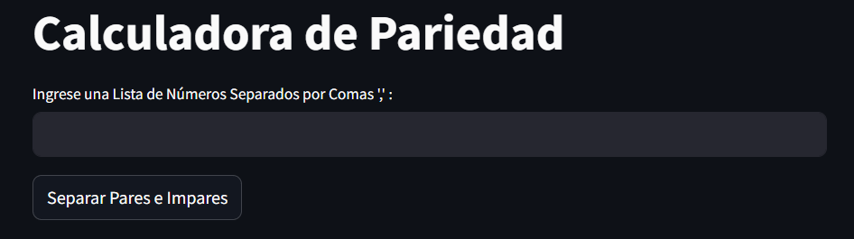

Una vez ingresada la lista de numeros y hacer click en el botón `Separar Pares e Impares` el programa devolvera dos listas distintas, una alojando los numeros pares y la otra los numeros impares.

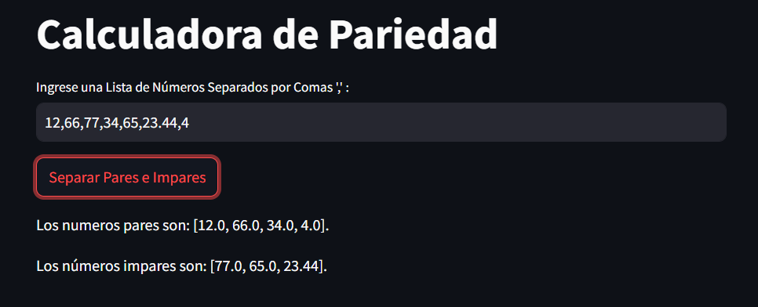

## Multiplicación
Este programa de la misma forma que anterior indica que se ingrese una lista de numeros separados por comas.

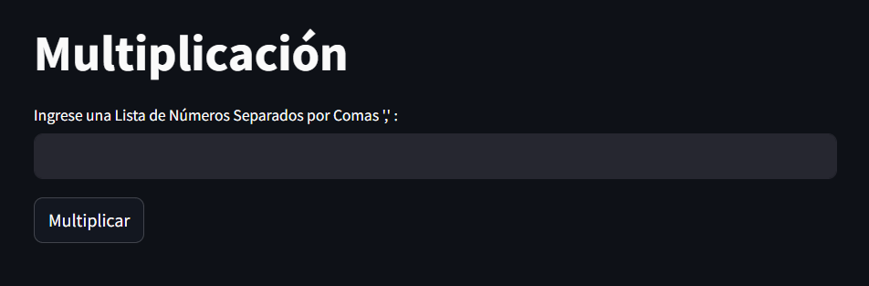

Una vez ingresada las lista de numeros, y al hacer click en el botón `Multiplicar`, el programa devolvera el resultado de la multiplicación de los elementos de la lista.

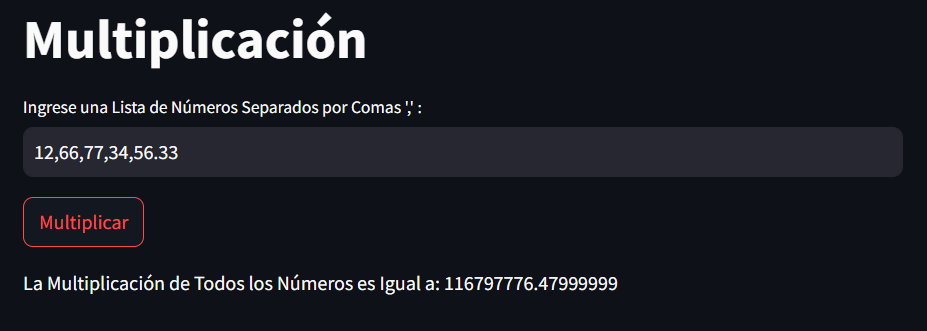

## Información Personal
Esta aplicación es un poco más compleja. Primero indica que se debe ingresar una lista de los parametros a completar. es decir, si quisieras tabular tu nombre y tu edad, simplemente deberias de ingresar: nombre, edad.


Una vez llena la lista, se muestra un apartado por parametro para escribir su valor y así poder tabularlo.

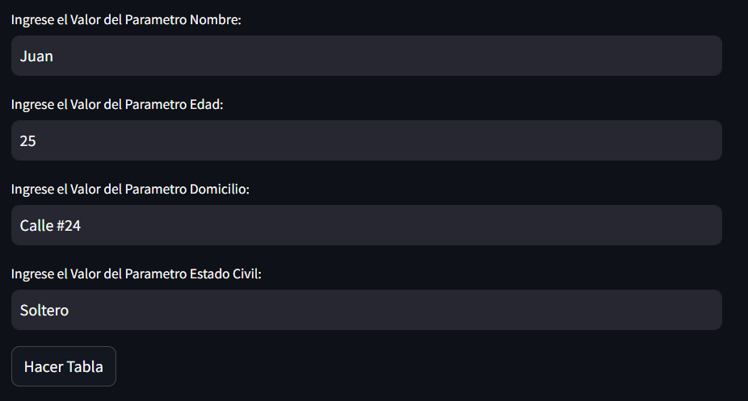

Con esto completado, nada más haría falta hacer click en el botón `Hacer Tabla` para que se muestre la tabla con tus parametros.

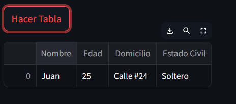

## Calculadora Flexible
Esta aplicación nos permite ingresar dos numeros distintos con los cuales realizaremos la operación.

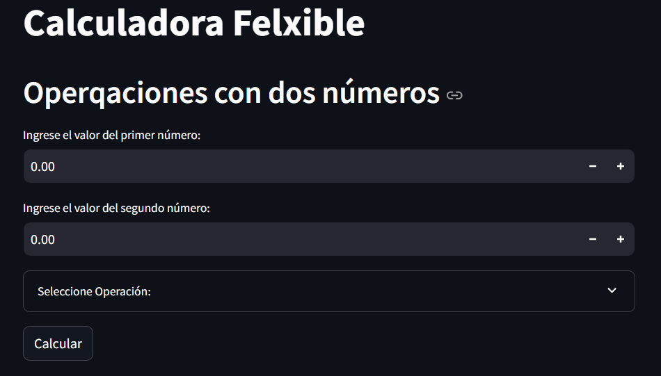

Una vez ingresados los numeros y habiendole dado click a la opcion `Seleccionar Operación`, se desplegará una lista con las operaciones disponibles y al seleccionar una solo basta presionar el botón `Calcular` y la aplicación realizará la operación.

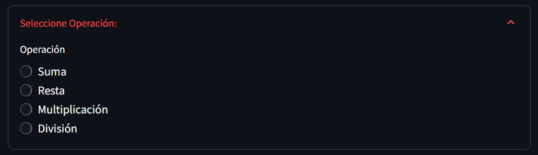

# FAQs

Dentro de la barra lateral, después de la aplicaciones se encuentra una sección de FAQs (Frequently Asked Questions) con dos preguntas frecuentes que al ser seleccionadas envian a una pagina de apoyo.

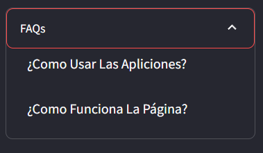

### Links
- [¿Cómo Usar Las Aplicaciones?](https://github.com/YerayAnguiano/menu-de-opciones)
- [¿Cómo Funciona La Página?](https://github.com/YerayAnguiano/Funcionameinto-de-Menu-de-Opciones)
