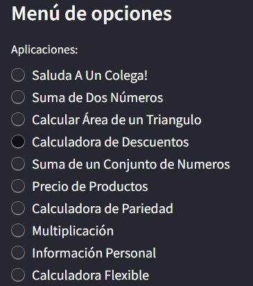
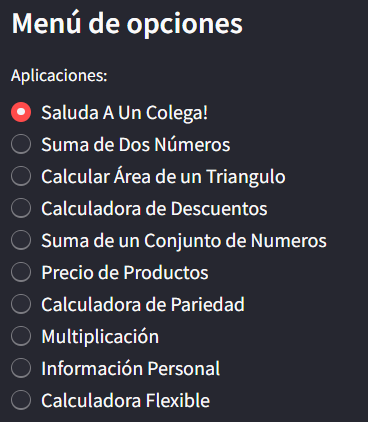
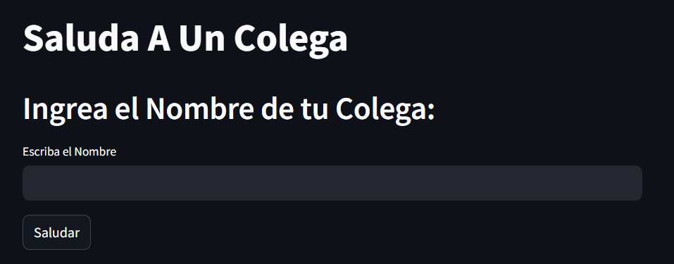

# Menú de Aplicaciones en Streamlit

Una manera interacrtiva de realizar calculos u otras operaciones con las distintas aplicaciones que ofrece la página.

[](https://blank-app-template.streamlit.app/)

### Cómo correrlo desde tu maquina

1. Instala los requisitos

   ```
   $ pip install -r requirements.txt
   ```

2. Corre la app con streamlit

   ```
   $ streamlit run streamlit_app.py
   ```

# Para una explicación detallada técnica del codigo visite:
[🐈‍⬛Abrir en GitHub](https://github.com/YerayAnguiano/Funcionameinto-de-Menu-de-Opciones)

## Cómo Usarlo

Al ingresar a la página lo primero que se nos muestra es la pagina pricipal, y la sidebar de streamlit con el menú de aplicaciones.
Selecciona una aplicación haciendo click sobre del nombre de la app.




# Saluda a un colega
En esta opción simplemente se debe agregar el nombre tuyo o de un colega en el apartado y seleccionar el botón saludar. que mostrará un saludo a tu colega.




